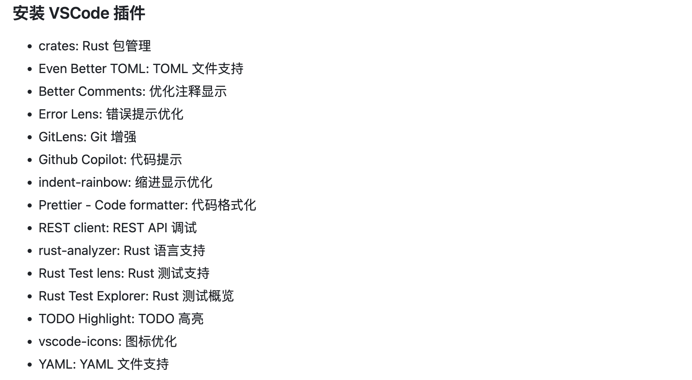

# rust-extension-pack-for-geektime-rust-bootcamp

<!-- ## Working with Markdown

You can author your README using Visual Studio Code. Here are some useful editor keyboard shortcuts:

* Split the editor (`Cmd+\` on macOS or `Ctrl+\` on Windows and Linux).
* Toggle preview (`Shift+Cmd+V` on macOS or `Shift+Ctrl+V` on Windows and Linux).
* Press `Ctrl+Space` (Windows, Linux, macOS) to see a list of Markdown snippets.

## For more information

* [Visual Studio Code's Markdown Support](http://code.visualstudio.com/docs/languages/markdown)
* [Markdown Syntax Reference](https://help.github.com/articles/markdown-basics/)

**Enjoy!** -->

## What is it for?

This extension pack is for the geektime rust bootcamp, the development environment is required by the [bootcamp](https://github.com/tyr-rust-bootcamp/template?tab=readme-ov-file#%E5%AE%89%E8%A3%85-rust).

## How to use it?

Just install it and enjoy!

## Contribution

Currently not available.

## Reference:

https://www.kenmuse.com/blog/creating-vs-code-extension-packs/